# Architecture

Letterboxd Vizard is a SvelteKit app. The user's export zip is parsed **in the browser**; only film
titles and years go to the server, which looks them up on TMDB (plus OMDb and TheTVDB as optional
extras) and caches the answers in SQLite. All charts are computed client-side from the enriched
library.

## 1. System overview

## 2. Use cases

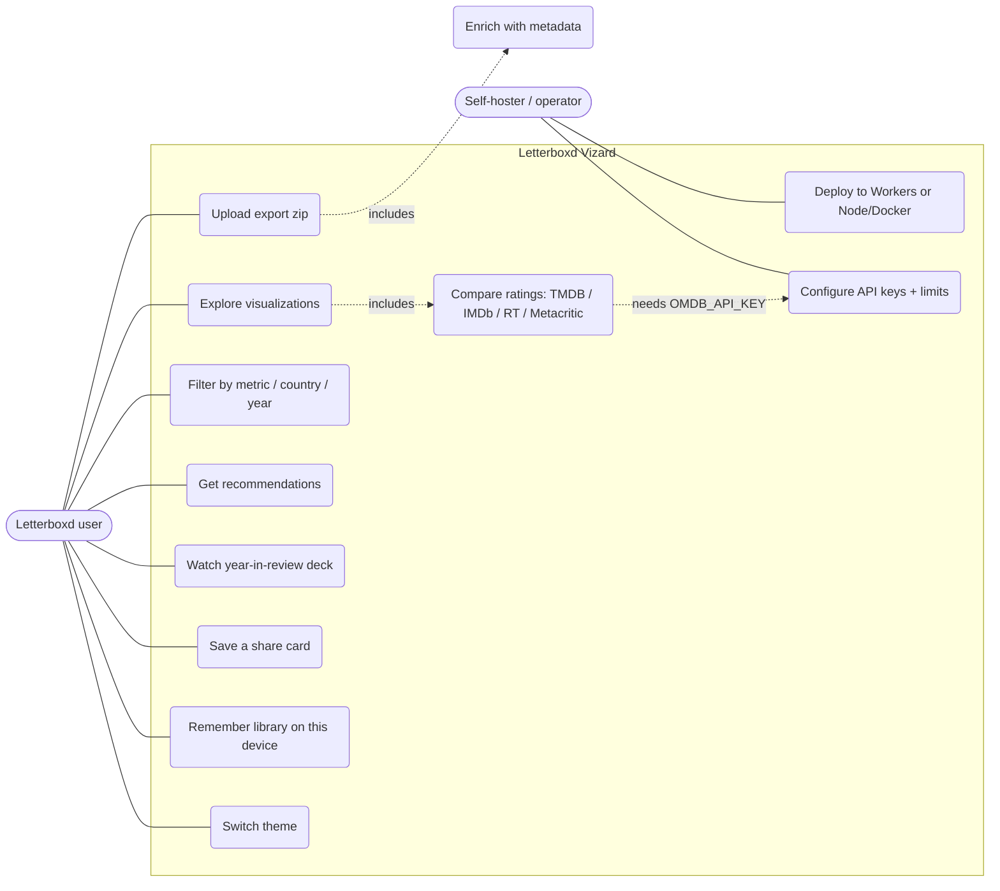

## 3. Upload and enrichment flow

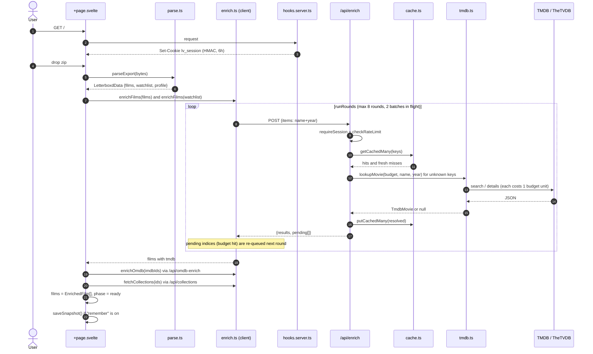

## 4. TMDB lookup strategy (`lookupMovie`)

## 5. Server request guards

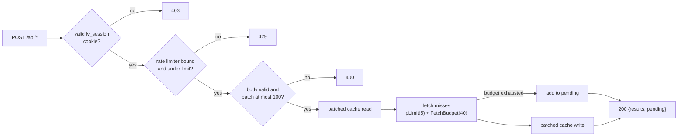

## 6. Server classes and modules

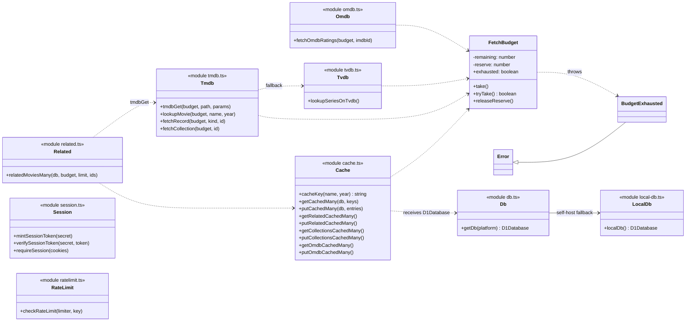

## 7. Data model

### Domain types (`lib/types.ts`)

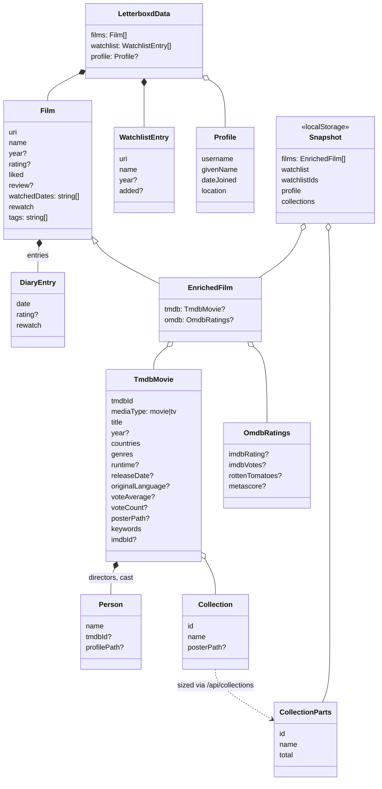

### Cache tables (`schema.sql`)

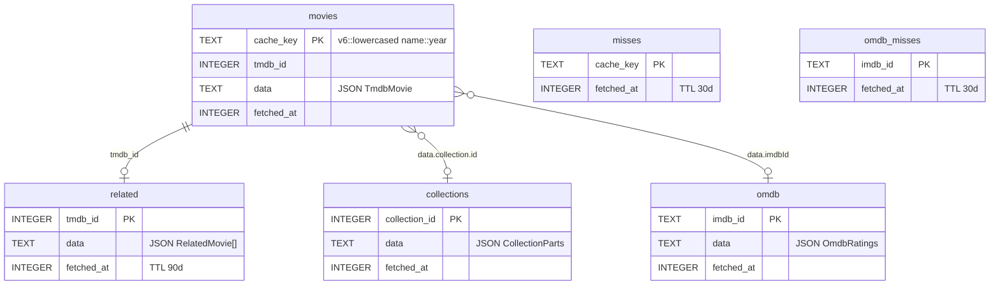

## 8. Recommendations flow

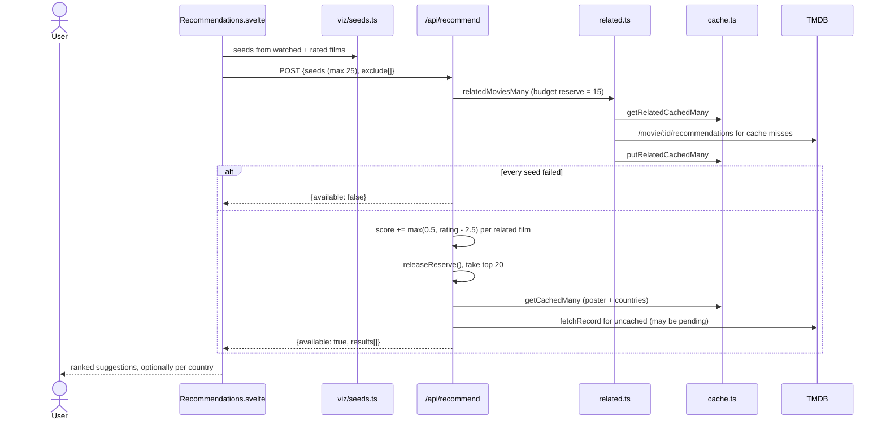

## 9. Client-side visualization layer

Charts are thin Svelte components over pure TypeScript functions that take `EnrichedFilm[]`, so the
statistics are unit-testable without a DOM.

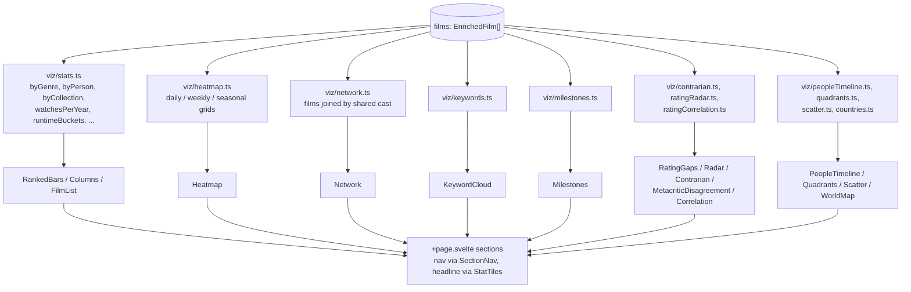

## 10. Year-in-review deck ("Wrapped")

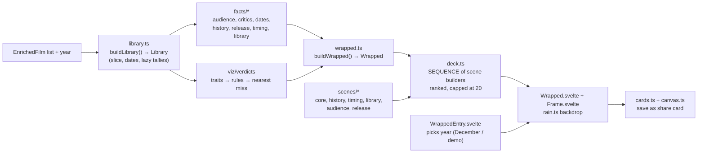

## 11. Page state machine

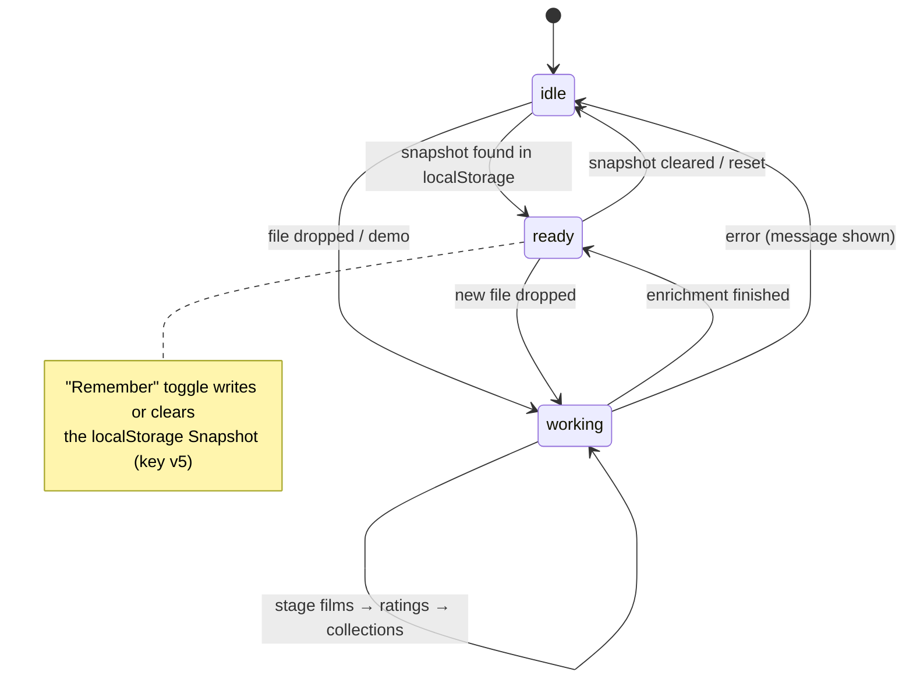

## 12. Deployment targets

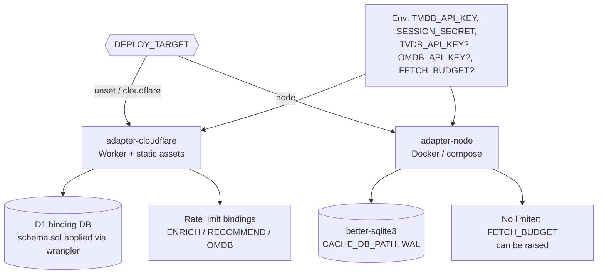

## How it works, in short

1. **Parse locally.** `parseExport` unzips with `fflate`, reads CSVs with PapaParse, and merges
   `watched`, `ratings`, `likes/films`, `diary`, `reviews` into one `Film` per name+year.
2. **Enrich in batches.** The client sends only `{name, year}` to `/api/enrich`. The server answers
   what it can from cache and fetches the rest from TMDB under a per-request `FetchBudget`
   (Workers' 50-subrequest limit). Anything cut off is returned in `pending` and the client's
   `runRounds` re-queues it, so large libraries still finish in one visit.
3. **Cache once, share across users.** Hits live in `movies`, known misses in `misses` (30-day TTL).
   Cache keys carry a `SCHEMA` generation; old generations are swept on first read.
4. **Add ratings and franchises.** IMDb ids from TMDB drive `/api/omdb-enrich`; collection ids drive
   `/api/collections` so "five of six" can be said.
5. **Visualize.** `+page.svelte` derives every chart's data from `EnrichedFilm[]` with pure
   functions in `lib/viz`, and feeds the same list into the Wrapped deck.
6. **Remember (opt-in).** A `Snapshot` in `localStorage` lets repeat visits skip the upload.
7. **Abuse guard.** `hooks.server.ts` issues an HMAC-signed session cookie on page loads; API routes
   require it, plus an optional Cloudflare rate limiter.
