# Architecture and design documentation

Letterboxd Vizard is a SvelteKit app. The user's export zip is parsed **in the browser**; only film
titles and years go to the server, which looks them up on TMDB (plus OMDb and TheTVDB as optional
extras) and caches the answers in SQLite. All charts are computed client-side from the enriched
library.

## 1. System overview

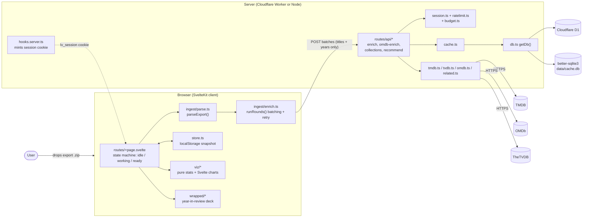

## 2. Use cases


## 3. Upload and enrichment flow

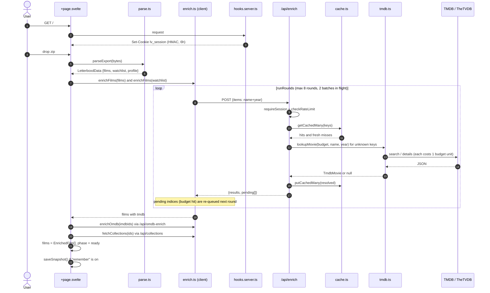

## 4. TMDB lookup strategy (`lookupMovie`)

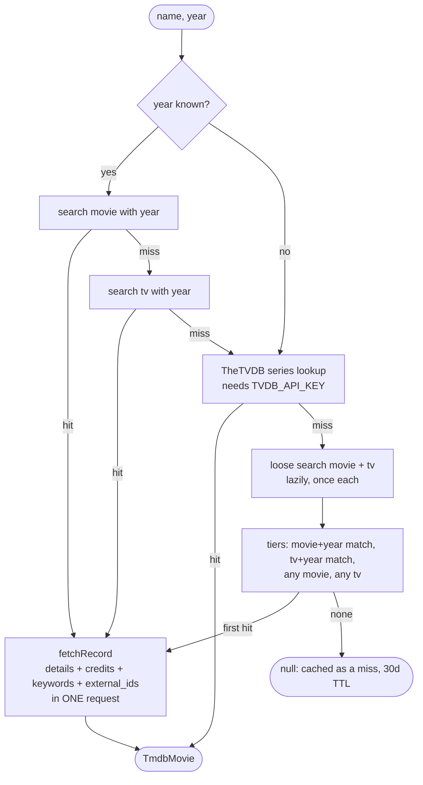

## 5. Server request guards

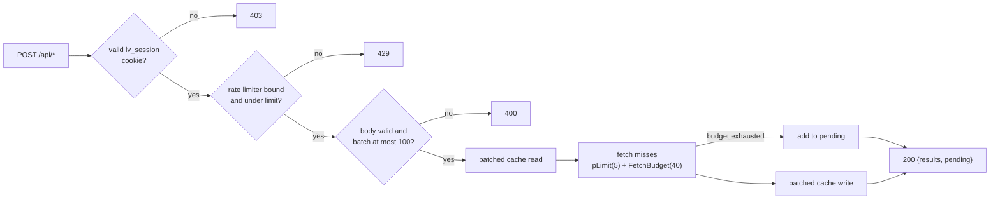

## 6. Server classes and modules

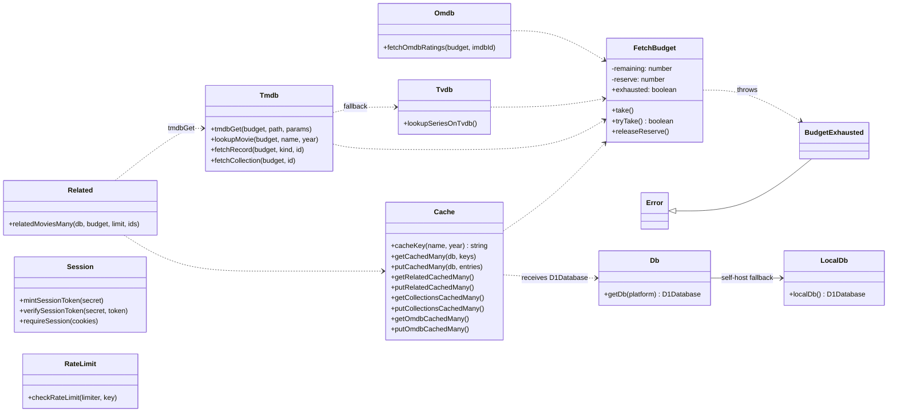

## 7. Data model

### Domain types (`lib/types.ts`)

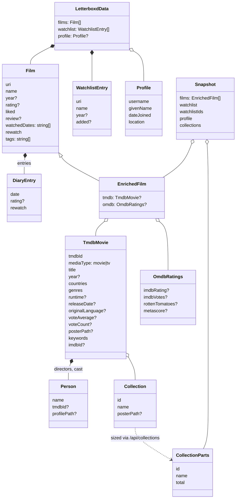

### Cache tables (`schema.sql`)

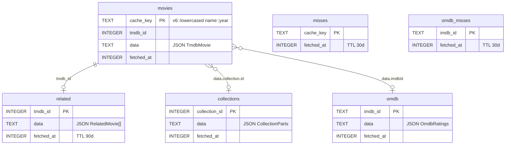

## 8. Recommendations flow

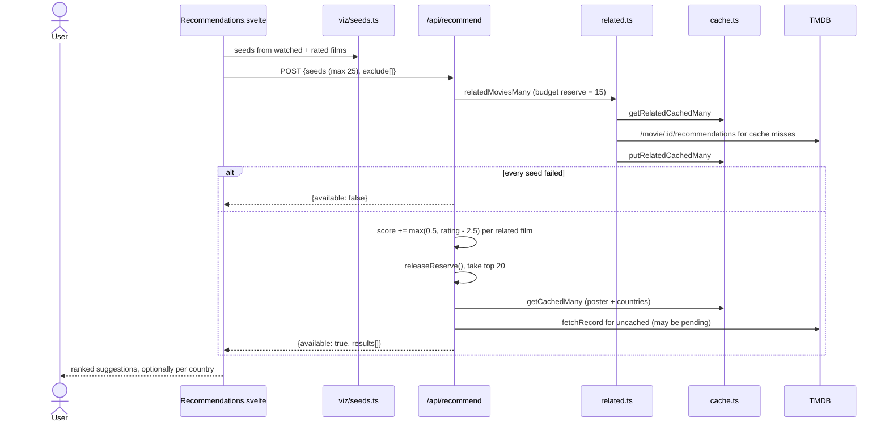

## 9. Client-side visualization layer

Charts are thin Svelte components over pure TypeScript functions that take `EnrichedFilm[]`, so the
statistics are unit-testable without a DOM.

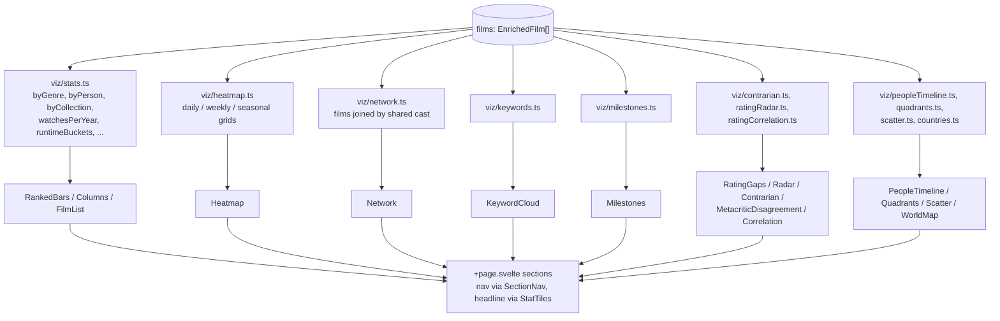

## 10. Year-in-review deck ("Wrapped")

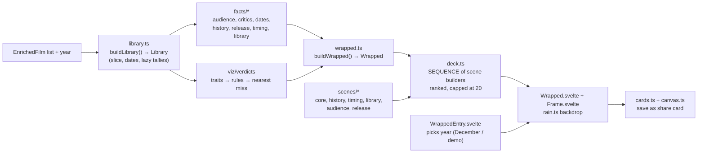

## 11. Page state machine

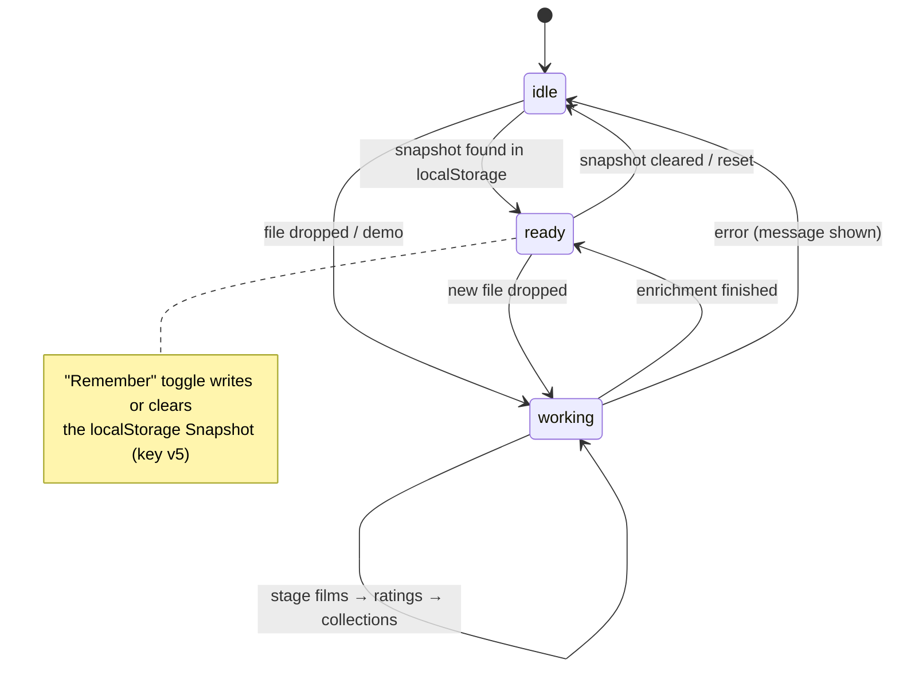

## 12. Deployment targets

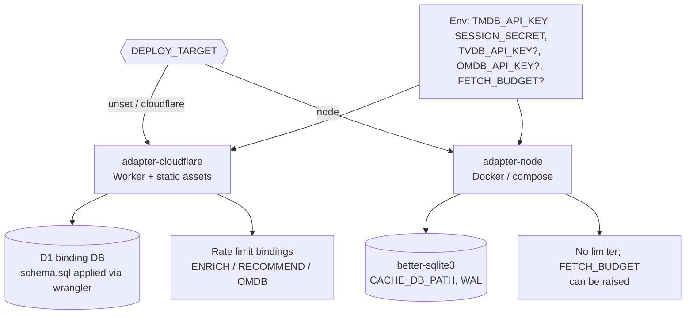

## 13. Use case catalogue

Actors: **Viewer** (a Letterboxd user, anonymous, no accounts), **Operator** (deploys and configures),
and the external systems **TMDB**, **OMDb**, **TheTVDB** which the server calls on the viewer's behalf.

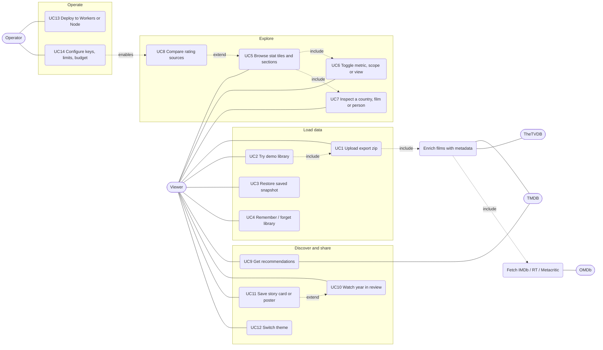

### Use case specifications

| ID | Use case | Trigger | Main flow | Alternatives and errors |
|----|----------|---------|-----------|-------------------------|
| UC1 | Upload export zip | Drop or pick a `.zip` in `FileDrop` | `parseExport` merges the CSVs, `enrichFilms` resolves titles on `/api/enrich`, `enrichOmdb` adds ratings, `fetchCollections` sizes franchises, page becomes `ready` | No `watched.csv` gives "not a Letterboxd export" and the page stays `idle`. Batches that fail or hit the budget are retried for up to 8 rounds. Watchlist and OMDb failures are swallowed so the main flow still completes |
| UC2 | Try demo library | `?demo` in dev mode | Fetches `/demo-export.zip` and runs UC1 | Dev only |
| UC3 | Restore snapshot | Page mount | `loadSnapshot` fills `films`, `watchlist`, `collections`, `profile`, page becomes `ready` | Missing, corrupt or old-generation snapshot is ignored |
| UC4 | Remember / forget | `RememberToggle` | On: `saveSnapshot` to `localStorage`. Off: `clearSnapshot` | Quota exceeded: toggle reverts and an error says data lasts for this visit only |
| UC5 | Browse sections | Scroll or `SectionNav` | `+page.svelte` derives each chart's data from `films` | Sections with no data (for example triangulation without OMDb) are hidden |
| UC6 | Toggle metric / scope | Buttons in a chart | `MetricToggle`, runtime scope, season scale, keyword cloud or bars switch the derived data | none |
| UC7 | Inspect a country, film or person | Click on map, bar or node | `selectByLabel` and chart state show a `FilmList` or detail | Click again clears the selection |
| UC8 | Compare rating sources | OMDb key present | Radar, contrarian, Metacritic gap and correlation charts | Without `OMDB_API_KEY` the endpoint returns all-null and the charts are hidden |
| UC9 | Get recommendations | Section renders | `pickDiverseSeeds` and `pickGenreSeeds` feed `/api/recommend`, with retries `1.5s, 3.5s, 7s` while records are `pending` | `available: false` shows the section as unavailable. Watchlist can be included or excluded |
| UC10 | Watch year in review | December, or demo | `buildRecap` then `buildWrapped` then `buildDeck`. Frames play on a timer or by keys. Gate frame opens the extras | Years under 10 films are not eligible. The current year is held back until December |
| UC11 | Save a share card | Share button in the deck | `storyCard` or `summaryCard` draws to canvas, `deliver` uses the Web Share API or downloads a PNG | User cancels the share sheet and nothing is saved. Canvas failure throws "picture could not be rendered" |
| UC12 | Switch theme | `ThemeSwitch` | Choose Catppuccin flavor and accent, stored in `localStorage` | Falls back to the system theme |
| UC13 | Deploy | Build with `DEPLOY_TARGET` | Cloudflare: Worker, assets, D1. Node: Docker with local SQLite | none |
| UC14 | Configure | `.env` / Worker vars | `TMDB_API_KEY`, `SESSION_SECRET`, optional `TVDB_API_KEY`, `OMDB_API_KEY`, `FETCH_BUDGET`, `CACHE_DB_PATH` | Missing `SESSION_SECRET` makes API routes return 500. Missing TMDB key makes lookups fail |

## 14. Class diagram: client ingest, state and persistence

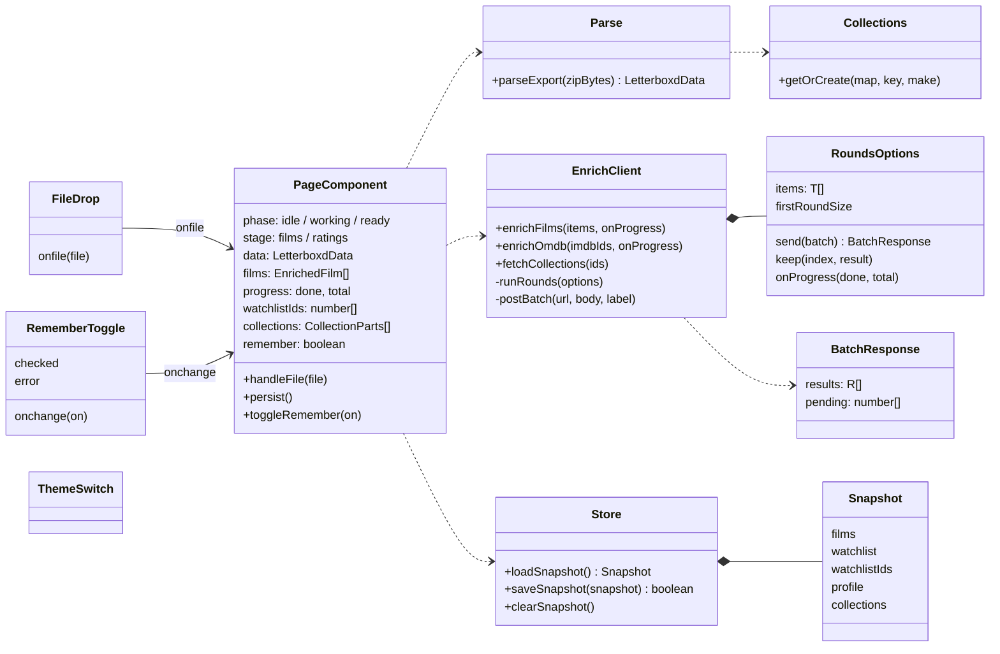

## 15. Class diagram: visualization data structures

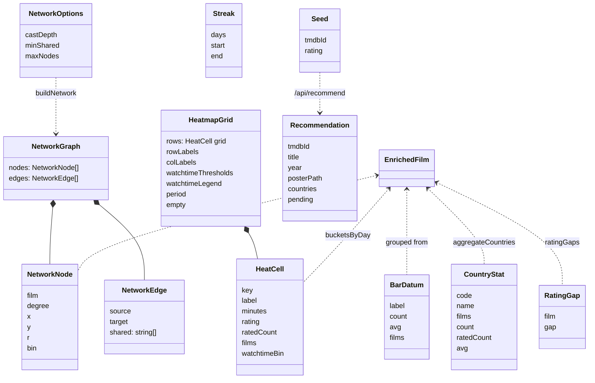

## 16. Class diagram: Wrapped deck, verdicts and share cards

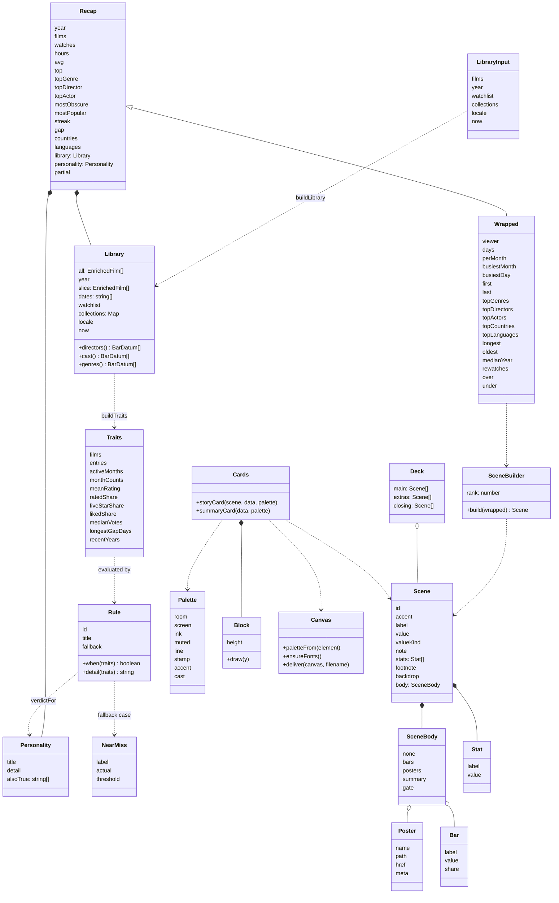

## 17. Svelte component hierarchy

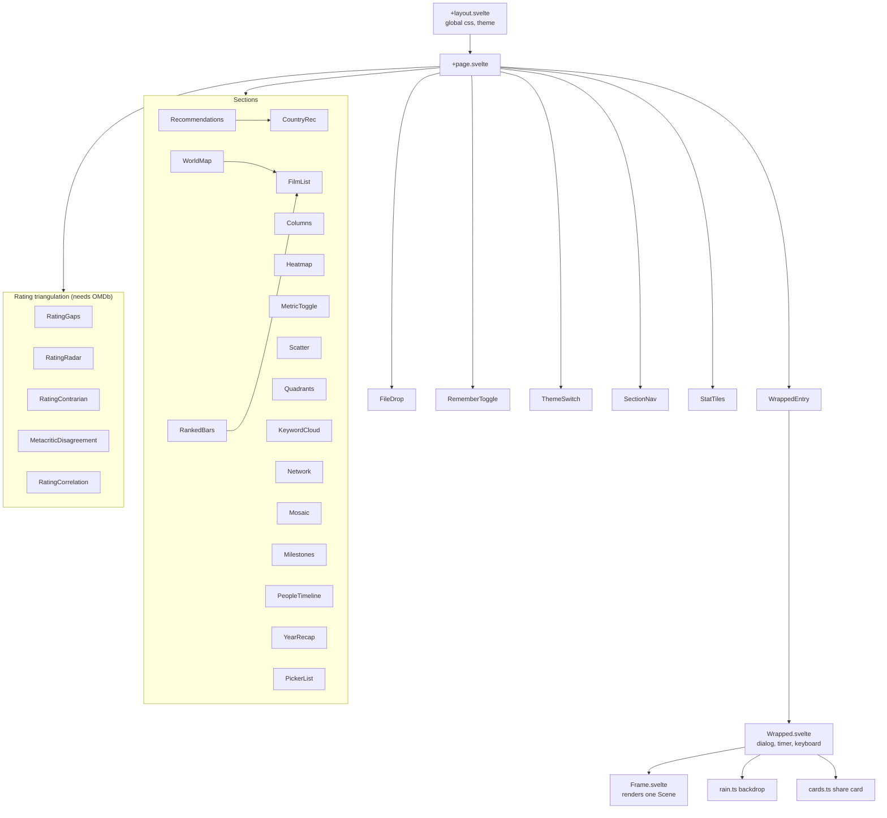

## 18. Activity: parsing and merging the export

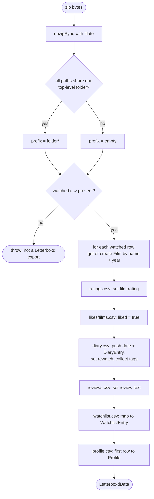

## 19. Activity: how a verdict is chosen

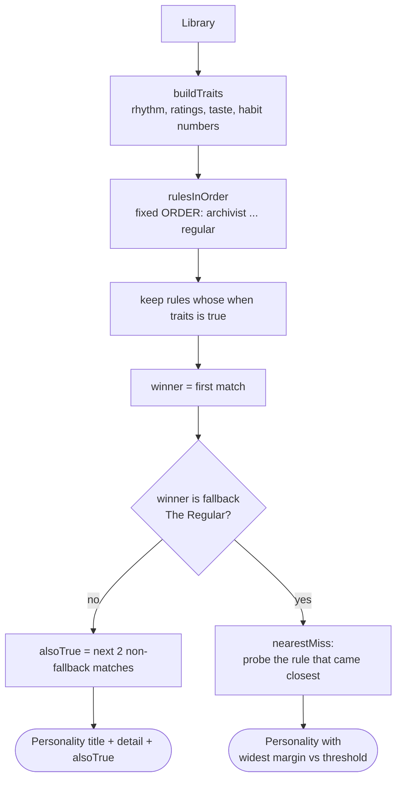

## 20. Activity: building the deck

```mermaid
flowchart TD
    w[Wrapped data] --> s[SEQUENCE of 38 scene builders<br/>in narrative order, each with a rank]
    s --> b[run every builder]
    b --> nn[drop builders that returned null<br/>not enough data for that fact]
    nn --> sort[sort by rank, keep top DECK_CAP = 20 ids]
    sort --> main[main: kept scenes in narrative order]
    sort --> extras[extras: scenes the cap pushed out]
    w --> close[closing: verdictScene + summaryScene]
    main --> asm[assemble deck, expanded?]
    extras --> asm
    close --> asm
    asm --> g{extras exist?}
    g -- yes --> gate[insert gate frame after main<br/>expanded: also append extras]
    g -- no --> out
    gate --> out([Scene list shown by Wrapped.svelte])
```

## 21. Sequence: share card

```mermaid
sequenceDiagram
    actor U as User
    participant W as Wrapped.svelte
    participant K as cards.ts
    participant V as canvas.ts
    participant N as Browser share / download

    U->>W: click Share
    W->>V: paletteFrom(element)
    alt last frame
        W->>K: summaryCard(data, palette)
    else any other frame
        W->>K: storyCard(scene, data, palette)
    end
    K->>V: ensureFonts()
    K->>K: measure blocks, centre stack, draw on 1080x1920 canvas
    K->>V: loadImage(poster urls)
    K-->>W: HTMLCanvasElement
    W->>V: deliver(canvas, filename)
    V->>V: toBlob image/png
    alt navigator.canShare with files
        V->>N: navigator.share
        N-->>V: shared or AbortError (cancelled)
    else fallback
        V->>N: anchor download, revoke URL after 1s
        N-->>V: saved
    end
```

## 22. Sequence: session cookie and API protection

```mermaid
sequenceDiagram
    participant B as Browser
    participant H as hooks.server.ts
    participant S as session.ts
    participant A as /api route

    B->>H: GET / (page load)
    H->>S: verifySessionToken(secret, cookie)
    alt missing, expired or bad signature
        H->>S: mintSessionToken(secret)
        S-->>H: expiry.hmacSha256
        H-->>B: Set-Cookie lv_session httpOnly, sameSite lax, 6h
    end
    B->>A: POST /api/enrich + cookie
    A->>S: requireSession(cookies)
    alt SESSION_SECRET not set
        S-->>B: 500
    else cookie invalid
        S-->>B: 403 reload the page
    else ok
        A-->>B: continue to rate limit, validation, lookup
    end
```

## 23. Sequence: client retry loop against the fetch budget

```mermaid
sequenceDiagram
    participant R as runRounds
    participant W1 as worker 1
    participant W2 as worker 2
    participant API as /api batch endpoint

    Note over R: round 0 uses batches of 50 (35 for collections)
    R->>W1: batch A
    R->>W2: batch B
    par
        W1->>API: POST A
        API-->>W1: results + pending [3, 7]
    and
        W2->>API: POST B
        API-->>W2: network error
    end
    W1->>R: keep resolved, queue pending 3 and 7
    W2->>R: queue the whole batch B
    Note over R: round 1..7 use batches of 15 for the leftovers
    loop until queue empty or 8 rounds
        R->>API: POST retry batches
        API-->>R: results + pending
    end
    Note over R: anything still unresolved stays null (shown as unmatched)
```

## How it works, in short

1. **Parse locally.** `parseExport` unzips with `fflate`, reads CSVs with PapaParse, and merges
   `watched`, `ratings`, `likes/films`, `diary`, `reviews` into one `Film` per name+year.
2. **Enrich in batches.** The client sends only `{name, year}` to `/api/enrich`. The server answers
   what it can from cache and fetches the rest from TMDB under a per-request `FetchBudget`
   (Workers' 50-subrequest limit). Anything cut off is returned in `pending` and the client's
   `runRounds` re-queues it, so large libraries still finish in one visit.
3. **Cache once, share across users.** Hits live in `movies`, known misses in `misses` (30-day TTL).
   Cache keys carry a `SCHEMA` generation; old generations are swept on first read.
4. **Add ratings and franchises.** IMDb ids from TMDB drive `/api/omdb-enrich`; collection ids drive
   `/api/collections` so "five of six" can be said.
5. **Visualize.** `+page.svelte` derives every chart's data from `EnrichedFilm[]` with pure
   functions in `lib/viz`, and feeds the same list into the Wrapped deck.
6. **Remember (opt-in).** A `Snapshot` in `localStorage` lets repeat visits skip the upload.
7. **Abuse guard.** `hooks.server.ts` issues an HMAC-signed session cookie on page loads; API routes
   require it, plus an optional Cloudflare rate limiter.
